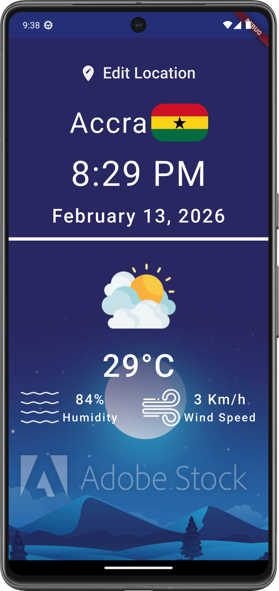
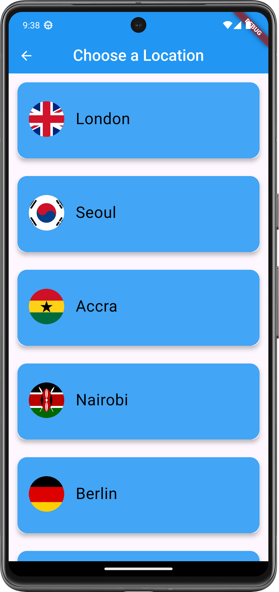
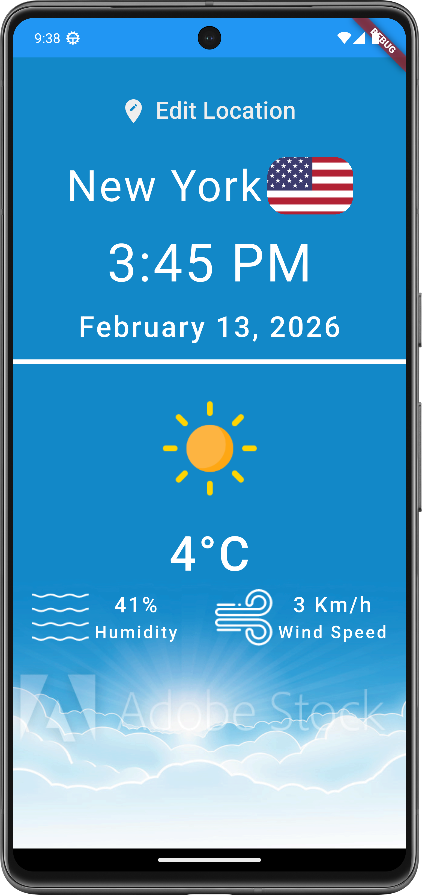
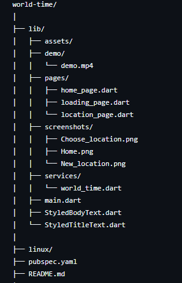

# 🌍 World Time App

  

A Flutter application that allows users to check the current time of different cities around the world in real time.

---

## 🚀 Features

- 🌎 View real-time clock of multiple world locations  
- 🌗 Dynamic background that changes based on day/night  
- 📍 Location selection screen  
- 🔄 API integration for live time data  

---

## 🛠 Built With

- Flutter  
- Dart  
- World Time API  

---

## 📸 Screenshots

  

    <strong>🏠 Home Screen</strong> 
    
  

  

    <strong>📍 Choose Location</strong> 
    
  

  

    <strong>📍 New Location</strong> 
    
  

---

## 🎥 Demo Video

Watch the full demo here:  

---

📂 Project Structure

  

